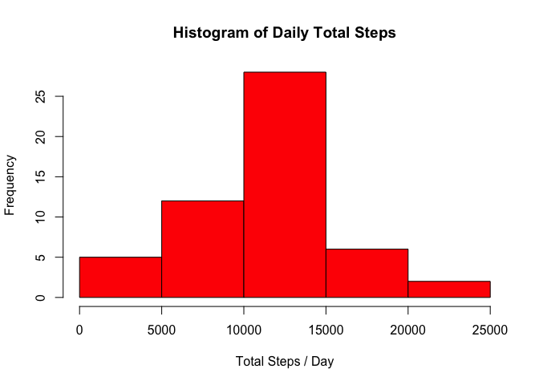
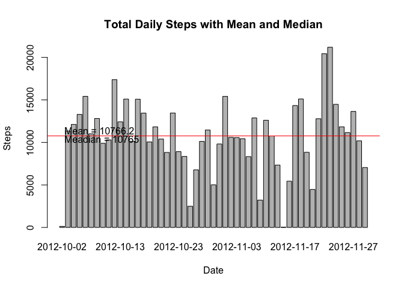
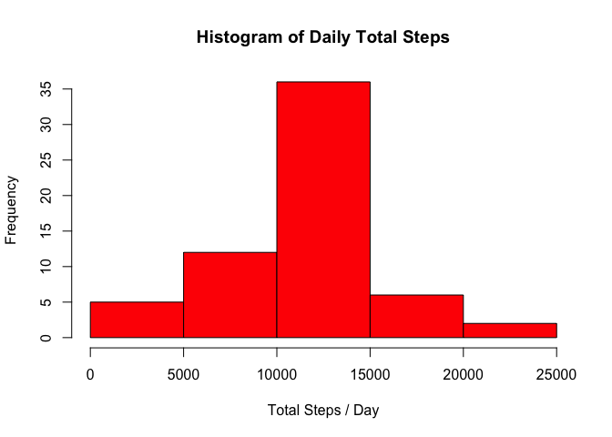
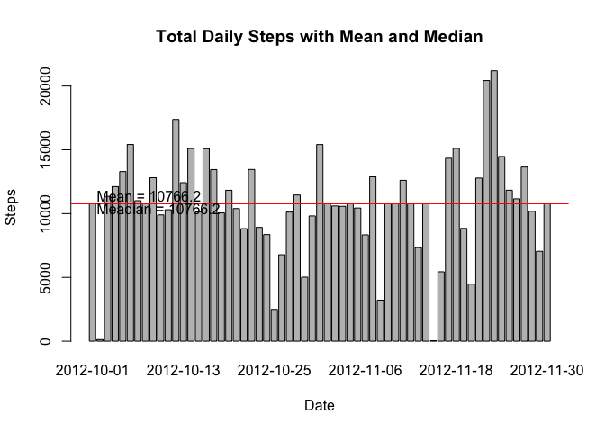
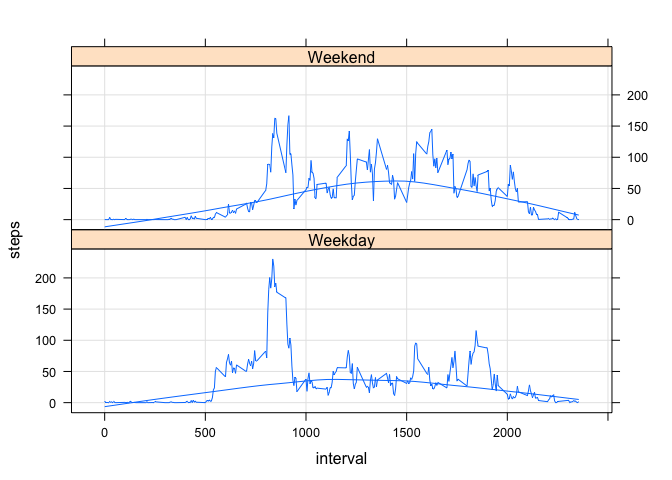

# Reproducible Research: Peer Assessment 1


## Loading and preprocessing the data

```r
##Reading the data
Act <- read.csv("activity.csv");
#Remove NA from data
Act <- na.omit(Act);
```

## What is mean total number of steps taken per day?

###1. Making a histogram of the total number of steps taken each day

```r
#Getting the total number of steps per day
Act.daily.sum   <- aggregate(steps ~ date, data=Act, sum)
names(Act.daily.sum)    <- c("date", "steps");
hist(Act.daily.sum$steps, col="red", xlab = "Total Steps / Day", main="Histogram of Daily Total Steps")
```

 


###2. Calculate and reporting the mean and median total number of steps taken per day

```r
act_mean   = mean(Act.daily.sum$steps);
act_median = median(Act.daily.sum$steps);
barplot(Act.daily.sum$steps, names.arg = Act.daily.sum$date, xlab = "Date", ylab = "Steps", main = "Total Daily Steps with Mean and Median")

#plot mean
abline(h=act_mean, col="green",  lty=3);
text(0, act_mean+500, paste("Mean =", round(act_mean, 1)) , pos = 4);

#plot meadian
abline(h=act_median, col="red");
text(0, act_median - 500, paste("Meadian =", round(act_median, 1)) , pos = 4);
```

 


* **Mean:** 10766.19

* **Median:** 10765.00

## What is the average daily activity pattern?
###1. Make a time series plot (i.e. type = "l") of the 5-minute interval (x-axis) and the average number of steps taken, averaged across all days (y-axis)


```r
Act.pat   <- aggregate(steps ~ interval, data=Act, mean)
names(Act.pat)    <- c("interval", "steps");

plot(Act.pat$interval, Act.pat$steps, type = "l", xlab = "Time", ylab = "Steps", main = "Average Daily Activity Pattern\n\n");
axis(3, at=c(0, 600, 1200, 1800, 2400), labels=c("00:00 AM", "06:00 AM", "12:00 PM", "06:00 PM", "00:00 AM"))
```

 

###2. Which 5-minute interval, on average across all the days in the dataset, contains the maximum number of steps?

Maximum of average number of steps **[206]** occured at **835**.

## Imputing missing values

### 1. Calculate and report the total number of missing values in the dataset (i.e. the total number of rows with NAs)


```r
#Reading data again with NA
Act <- read.csv("activity.csv");
na_count <- sum(!complete.cases(Act));
```

**Total Number of Missing values:** 2304

### 2. Devise a strategy for filling in all of the missing values in the dataset. The strategy does not need to be sophisticated. For example, you could use the mean/median for that day, or the mean for that 5-minute interval, etc.

We chose  the mean for that 5-minute interval to fill the missing values.


```r
#Filling Missing data with daily average interval steps
Act.merge <- merge(Act, Act.pat, by = "interval", all = TRUE);
steps.na <- is.na(Act.merge$steps.x);
Act.merge$steps.x[steps.na] = Act.merge$steps.y[steps.na];
Act.merge <- Act.merge[, c(2,3,1)];
names(Act.merge) <- c("steps", "date", "interval");
```

### 3. Create a new dataset that is equal to the original dataset but with the missing data filled in.

```r
Act_Na <- Act.merge;
```

### 4. Make a histogram of the total number of steps taken each day and Calculate and report the mean and median total number of steps taken per day. Do these values differ from the estimates from the first part of the assignment? What is the impact of imputing missing data on the estimates of the total daily number of steps?


```r
#Histogram of daily step
Act.daily.sum   <- aggregate(steps ~ date, data=Act_Na, sum)
names(Act.daily.sum)    <- c("date", "steps");
hist(Act.daily.sum$steps, col="red", xlab = "Total Steps / Day", main="Histogram of Daily Total Steps")
```

 

```r
#Calculate mean and median
act_mean   = mean(Act.daily.sum$steps);
act_median = median(Act.daily.sum$steps);
barplot(Act.daily.sum$steps, names.arg = Act.daily.sum$date, xlab = "Date", ylab = "Steps", main = "Total Daily Steps with Mean and Median")

#plot mean
abline(h=act_mean, col="green",  lty=3);
text(0, act_mean+500, paste("Mean =", round(act_mean, 1)) , pos = 4);

#plot meadian
abline(h=act_median, col="red");
text(0, act_median - 500, paste("Meadian =", round(act_median, 1)) , pos = 4);
```

 

* **Mean:** 10766.19

* **Median:** 10766.19

* Although, these values differ from the estimates from the first part of the assignment, the impact of imputing missing data on the estimates of the total daily number of steps is minimal.

## Are there differences in activity patterns between weekdays and weekends?

### 1. Create a new factor variable in the dataset with two levels -- "weekday" and "weekend" indicating whether a given date is a weekday or weekend day.


```r
#convert date to DATE type
Act_Na$date <- as.Date(Act_Na$date);
Act_Na$day <- ifelse(weekdays(Act_Na$date) == "Saturday" | weekdays(Act_Na$date) == "Sunday", "Weekend", "Weekday");
Act.pat.weekday   <- aggregate(steps ~ interval, data=Act_Na[Act_Na$day=="Weekday", ], mean)
Act.pat.weekend   <- aggregate(steps ~ interval, data=Act_Na[Act_Na$day=="Weekend", ], mean)
Act.pat.weekday$day = "Weekday";
Act.pat.weekend$day = "Weekend";
Act.pat <- rbind(Act.pat.weekday, Act.pat.weekend);
```

### 2. Make a panel plot containing a time series plot (i.e. type = "l") of the 5-minute interval (x-axis) and the average number of steps taken, averaged across all weekday days or weekend days (y-axis)


```r
library(lattice)
xyplot(steps ~ interval | factor(day), Act.pat, type=c("l", "g", "smooth"), layout = c(1,2))
```

 
